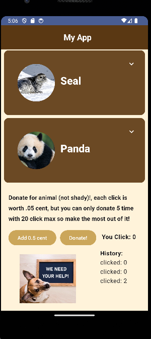

# Animal App - README

## Introduction

Welcome to Animal App, a small and educational application designed to serve as a wiki for learning about various animals. This app is a project created to help you become familiar with Kotlin, a modern and versatile programming language. Not only can you explore interesting facts about different animals, but you also have the opportunity to contribute by making a donation based on the number of clicks.

## Features

### 1. Animal wiki

Use Animal App as a learning resource to discover more about them. Each animal entry have a breif description of them.

### 2. Contribution Section

Animal App encourages user participation by offering a donation section. This feature allows you to contribute to the app's development and maintenance based on the number of clicks.

## Getting Started

To start using Animal App, follow these simple steps:

1. Download and install the app on your device.

2. Launch the app and start exploring information about animals by browsing the available entries.

3. Navigate through the animal catalog to learn more about them.

4. If you love animal, head to the donation section and make a donation based on the number of clicks you've made.

